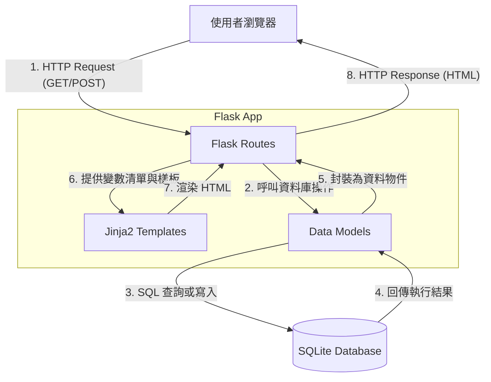

# 系統架構設計

## 1. 技術架構說明

本系統為一款精簡且易於部署的任務管理系統，採用直覺的伺服器端渲染技術棧。

### 選用技術與原因
- **後端：Python + Flask**
  輕巧、靈活的微框架，能夠快速搭建後端結構。不具備龐大的內建功能，讓開發者有更高的自由度，非常適合製作早期的 MVP 專案。
- **模板引擎：Jinja2**
  與 Flask 完美整合的模板系統。透過它可以輕易掌控 HTML，將後端提供的任務清單、重要程度等變數，以直覺的語法渲染進頁面中，不需要另外建置複雜的前端服務。
- **資料庫：SQLite**
  將關聯式資料庫直接建置於本機檔案中，省去了租用或設定資料庫伺服器的時間。系統初期僅提供單人使用（或者少量資料），這類輕負荷的應用場景正是 SQLite 發揮優勢的地方。

### Flask MVC 模式說明
雖然 Flask 不像其他框架強制規定 MVC 的資料夾，但我們在設計上依舊遵循這個概念：
- **Model（模型）**：負責系統核心的商業邏輯與資料定義。處理 SQLite 的底層呼叫，包括任務的新增、尋找、狀態更新及刪除。
- **View（視圖）**：在此對應的是 Jinja2 HTML 樣板，專門處理呈現畫面的邏輯。
- **Controller（控制器）**：即 Flask 的 Routes 路由，負責接收來自使用者的網路請求，呼叫對應的 Model 進行資料庫操作，接著結合結果資料與 Jinja2 的 View 做整合回傳給使用者。

---

## 2. 專案資料夾結構

本專案切分成清晰的檔案夾架構，利於開發與後續功能維護擴展。

```text
web_app_development/
├── app/
│   ├── models/           ← 資料庫模型，封裝與 SQLite 溝通的邏輯
│   │   └── task.py       ← 任務資料表 (Task) 之設定與方法
│   ├── routes/           ← Flask 路由 (Controller)
│   │   └── task_routes.py ← 負責處理新增、讀取、更新、刪除任務之 Request
│   ├── templates/        ← Jinja2 HTML 模板 (View)
│   │   ├── base.html     ← 網站共用外框（頭部資源、導覽列等）
│   │   └── index.html    ← 實際渲染出來的任務總覽首頁
│   └── static/           ← CSS / JS 等靜態資源
│       ├── css/
│       │   └── style.css ← 客製化網頁介面樣式表
│       └── js/
│           └── main.js   ← 基礎的互動提示（如：確認是否刪除之彈窗）
├── instance/
│   └── database.db       ← 實體資料庫檔案，所有的任務都存放在這裡
├── docs/                 ← 文件存放區
│   ├── PRD.md            ← 產品需求文件
│   └── ARCHITECTURE.md   ← 系統架構設計 (本文件)
├── app.py                ← 專案的進入點，用於初始化 Flask 及註冊相關資源
└── requirements.txt      ← 記錄 Python 的相依套件與版本清單
```

---

## 3. 元件關係圖

透過以下的流程圖，我們可以清楚預視當使用者（Browser）對系統提出請求時，內部元件的互動順序。



---

## 4. 關鍵設計決策

以下列出幾個在考量需求、時間和難易度後所做出的重要技術決定：

1. **傳統伺服器端網頁渲染 (SSR)**
   為了極大化開發效率、減少架構複雜度與部署門檻，我們放棄了前後端分離框架（如 Vue、React）。所有的畫面皆由 Flask 伺服器進行組合並送至瀏覽器顯示。
2. **Post/Redirect/Get (PRG) 模式**
   只要使用者在頁面上進行資料寫入的操作（新增任務、刪除、標記完成、更改重要程度），後端完成後都會重新導引 (Redirect) 至首頁。這一點能大幅避免使用者按 F5 重新整理時所產生的重複送出表單問題，也能確保用戶看見的是從資料庫抓取的最新狀態。
3. **架構分層而不是集中式寫法**
   我們未把全部的函數塞入 `app.py` 中，而是提早將應用程式切為 Models 及 Routes。如此一來，每個檔案的職責變得單一且明確，若系統需要擴充新功能（例如帳號管控系統）時，架構足以支撐並減少程式碼混雜的狀況發生。
4. **採用原生的 SQLite**
   作為目標客群為大學生使用的輕量排程工具，不需要龐大伺服器提供的資料吞吐量。使用 SQLite 將資料存在專案同目錄下除了方便移交與備份外，開發時程也省下了對外連線的設定挑戰。
