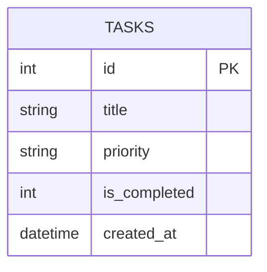

# DB Design - 資料庫設計文件

根據 PRD 與系統架構，本系統採用 SQLite 做為主要資料庫，在此定義相關的實體關係、資料表設計與 SQL 語法。

## 1. ER 圖（實體關係圖）



## 2. 資料表詳細說明

### `tasks` (任務資料表)

用來儲存所有使用者的待辦事項與相關設定。每筆紀錄代表一個任務。

| 欄位名稱       | 型別       | PK / FK | 必填 | 預設值            | 說明                                           |
| :------------- | :--------- | :------ | :--- | :---------------- | :--------------------------------------------- |
| `id`           | INTEGER    | PK      | 是   | (AUTOINCREMENT)   | 唯一流水號，用於識別每個任務                   |
| `title`        | TEXT       |         | 是   | 無                | 任務內容、名稱                                 |
| `priority`     | TEXT       |         | 是   | '低'              | 任務重要程度（例如：高、中、低）               |
| `is_completed` | INTEGER    |         | 是   | 0                 | 是否已完成（0：未完成，1：已完成）             |
| `created_at`   | DATETIME   |         | 否   | CURRENT_TIMESTAMP | 任務建立的時間，用於排序或歸檔                 |

## 3. SQL 建表語法

本專案建表語法請參考 `database/schema.sql`：

```sql
CREATE TABLE IF NOT EXISTS tasks (
    id INTEGER PRIMARY KEY AUTOINCREMENT,
    title TEXT NOT NULL,
    priority TEXT NOT NULL DEFAULT '低',
    is_completed INTEGER NOT NULL DEFAULT 0,
    created_at DATETIME DEFAULT CURRENT_TIMESTAMP
);
```

## 4. Python Model 程式碼

我們採用 Python 內建的 `sqlite3` 撰寫模型，具備常見的 CRUD 方法（create, get_all, get_by_id, update, delete），並提供一個 `toggle_status` 用於直接切換完成狀態。

完整程式碼存放在 `app/models/task.py` 檔案。
