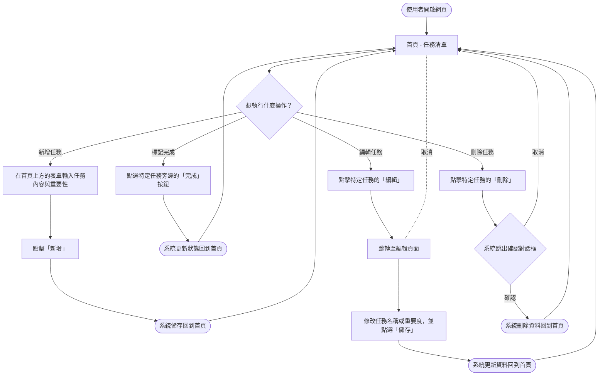
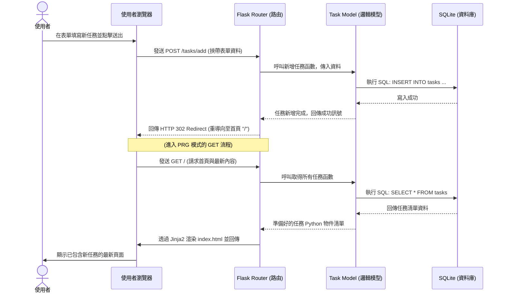

# 流程圖文件 (FLOWCHART)

根據我們定義的專案需求 (PRD) 與系統架構 (ARCHITECTURE)，本文件描繪了使用者在系統中的操作路線，以及在特定操作下系統背後的資料流動情形。

---

## 1. 使用者流程圖 (User Flow)

此流程圖展示出目標用戶（大學生）進入任務管理系統後，他們可以進行的各項操作路徑。由於我們採用了**回歸首頁設計**(PRG模式)，各項操作完成後，系統都會引導用戶回到「任務列表首頁」，讓體驗流暢且維持單一的進度檢視點。

---

## 2. 系統序列圖 (Sequence Diagram)

此序列圖以核心功能「**新增任務**」為例，展現從使用者在瀏覽器送出表單開始，經由 Flask 路由、資料庫寫入，直到重新渲染 (Post-Redirect-Get) 畫面的系統內部運作流程。

---

## 3. 功能清單對照表

做為之後撰寫程式及設計資料庫 API 的依據，這是本系統將要實作的所有功能與其對應的 URL 設計規範。

| 功能描述 | HTTP 方法 | URL 路徑 (Route) | 動作 / 說明 |
| :--- | :--- | :--- | :--- |
| **檢視任務首頁** | `GET` | `/` | 讀取全部任務清單並渲染首頁 `index.html`。 |
| **新增任務操作** | `POST` | `/tasks/add` | 接收表單傳來的名稱與重要性，寫入後重導向 `/`。 |
| **標記/切換完成狀態** | `POST` | `/tasks/<int:task_id>/toggle` | 更新目標任務是否完成的狀態，完成後重導向 `/`。 |
| **載入編輯任務頁面** | `GET` | `/tasks/<int:task_id>/edit` | 尋找目標任務並渲染專屬的編輯表單頁面 `edit.html`。 |
| **送出編輯更新任務** | `POST` | `/tasks/<int:task_id>/edit` | 接收更新後的表單資料覆寫任務內容，完成後重導向 `/`。 |
| **刪除任務操作** | `POST` | `/tasks/<int:task_id>/delete` | 直接把目標任務從資料庫刪除，完成後重導向 `/`。 |

> **提示：** 修改（除了載入表單）、狀態切換、刪除等行為皆設計為 `POST` 方法，以防禦 CSRF 攻擊及預防瀏覽器因預載（Preload）而產生非預期的資料庫更動。
